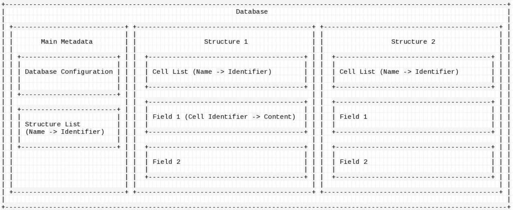

# MSDB - Mobile Secure DataBase

  

msdb is a user-friendly, intuitive and standalone database.
[](https://asciinema.org/a/Fo3oAjaENzYZfuQfMC3RxiSPG)

## Features

- No installation required / database stored in folder

- State-of-the-art encryption

- Relatively high performance

- Simple code logic

- Dynamic field (you can store different type of content in one field)

- User-friendly

## Getting started

### Prerequisites

- `rustc` installed(building). Nightly channel is recomended, while stable channel should also work.

- `libsodium` installed. MSDB relies on `sodiumoxide`, which is a rust binding for libsodium.

### Compiling

```bash
cargo build --release
```

### Running

#### Command line interface

`./msdb` will initiate a command line interface

#### Execute script file

`./msdb -i SCRIPTNAME` will execute commands inside the script

## Simple user guide

### Structure in one graph



### Commands reference

Both commands in the command script and commands in the cli follows the same structure:

```bash
COMMAND [COMMAND ARGUMENTS]
```

*Each line in command script will be treated as a command.*

#### Create database / Decrypt(Load) database / Exit / Logout

**Only these commands can be executed without loading any database.**

- `create DATABASENAME`

    Create a database by specifying its name.
- `decrypt DATABASENAME`

    Decrypt a database and load it into cache.
- `exit`

    Drop everything inside cache and stop the database.
- `logout`

    Similear to `exit` but the command line interface will not exit.

#### Create(Delete / Modify) Structure / Object / Cell

- `new struct STRUCTNAME`

    Create a new structure
- `new OBJECTNAME`

    Create a new object (Only work when you are inside a structure)
- `new CELLNAME CELLTYPE CELLCONTENT`

    Create a new cell (Only work when you are inside a object)

    Available cell type & cell content:

    1. TYPE = `literal`; CONTENT = `anything in utf-8`

    2. TYPE = `blob`; CONTENT = `any filename`(file content will be written into database)

    3. TYPE = `link`; CONTENT = `another cell's identifier` / `another field identifier/another cell's identifier` / `another structure identifier/another field identifier/another cell's identifier`

    4. TYPE = `revlink`; CONTENT = *same as `link`*

- `alter CELLNAME CELLTYPE CELLCONTENT`[WIP]

    Change cell content / cell type (Only work when you are inside a object)

- `del CELLNAME / OBJECTNAME / STRUCTNAME`

    Delete object / structure. Note that due to preformance issue, cells in object may not be deleted. If you are willing to sacrifice preformance to minify database storage, please use `wipe`.
- `wipe OBJECTNAME`[WIP]

    Delete object and every cell related

#### Select(deselect) Structure / Object / Cell

- `select STRUCTNAME/OBJECTNAME/CELLNAME`

    select a structure/object/cell (It will select structure when you are inside database root, and select object if you are inside a structure, etc.)
- `leave`

    deselect a structure/object/cell (deselect structure when inside structure, etc.)

### Listing / Querying cells

- `ls`

    list cells inside object / objects inside structure / structures inside database
- `read CELLNAME` [WIP]

    output cell content (Only work when you are inside a object)
- `pwd`

    Show current location

### Write to disk / Read from disk

**Note that due to preformance issue, msdb will not automatically write and/or sync with disk, meaning that everyting you done in database is temporary. You will need following commands to manually do that.**

- `sync`

    Write database changes onto disk
- `load [CELLNAME]`

    Explicitly specify a cell to be loaded into cache. Normally, cells inside object will not automatically loaded due to slow performance. `load` without specifying CELLNAME will load all fields inside structure.

### Dangerous / Debugging

**These commands should not be used unless you are absolutely sure what you are doing.**

- `unload STRUCTURENAME`

    Explicitly remove structure from cache. May improve performance.
- `setprop NAME VALUE`

    Create/alter a metadata propertie. If current location is in database root, it will write to main metadata; if in a structure, it will write to structure metadata.
- `getprop`

    View metadata properties

- `debls`
    Old version of `ls`

> Special note: if you are using a command script, every parameter except `password` for `create` and `decrypt` command is **required**.

## Contributors

| [**moelife-coder**](https://github.com/moelife-coder) |
| :---: |
| [](https://github.com/moelife-coder)|

## Support

You may use [Github Issues](https://github.com/moelife-coder/msdb/issues) to report bugs. Please note that currently the application is still in early-stage, and there might be many bugs.

## License

This project is licensed under the [GNU General Public License v3.0 only](license).
