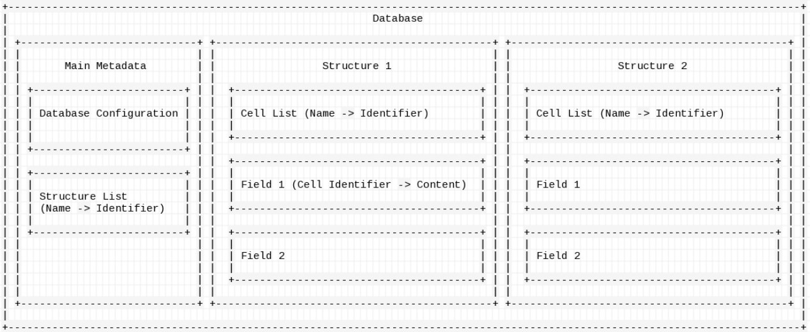

# MSDB - Mobile Secure DataBase
msdb is a user-friendly, intuitive and standalone database.
## Getting started
### Prerequisites
- `rustc` installed(building). Nightly channel is recomended, while stable channel should also work.
- `libsodium` installed. MSDB relies on `sodiumoxide`, which is a rust binding for libsodium.
### Compiling
```bash
cargo build --release
```
## Simple guide
### Structure in one graph

### Commands
These are the commands you may use inside MSDB command line interface:
1. `create DATABASENAME`
    Create a database by specifying its name.
2. `decrypt DATABASENAME`
    Decrypt a database and load it into cache. **Commands marked with a `*` will not work unless the database is loaded inside cache.**
3. `exit`
    Drop everything inside cache and stop the database.
4. *`logout`
    Similear to `exit` but the command line interface will not exit.
5. *`new struct STRUCTNAME`
    Create a new structure
6. *`new OBJECTNAME`
    Create a new object
7. *`new CELLNAME CELLTYPE CELLCONTENT`
    Create a new cell
8. *`select STRUCTNAME/OBJECTNAME/CELLNAME`
    select a structure/object/cell
**[WIP]**
## License
This project is licensed under the [GNU GENERAL PUBLIC LICENSE Version 3](license).